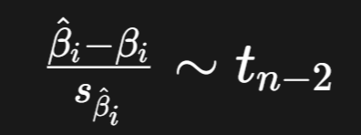
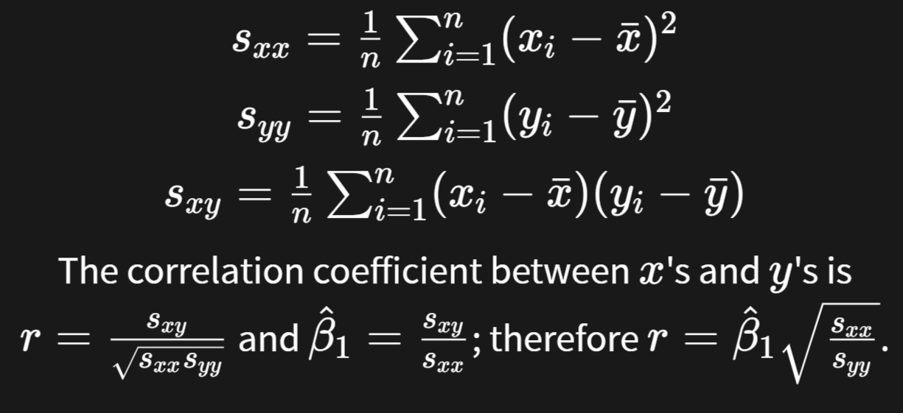
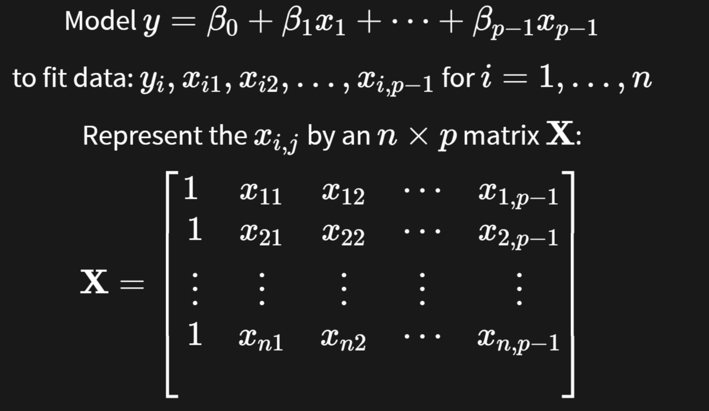

## 11. Linear Regression and Chi-Squared Test of Independence (Applications to GWAS).

### 11.1 Brief review of linear models

A linear model is a simple way to demonstrate a relationship between two variables. The most powerful statistical tools to process sequencing data exploit the relationship between linear models and hypothesis testing. When we utilize hypothesis testing with linear models, it allows us to ascribe significance to relationships in the data. This is useful in techniques such as Genome Wide Association Studies (GWAS), where we seek to uncover relationships between genetic patterns and certain phenotypes or diseases. Some might even consider linear models to be a simple form of machine learning! The equation for a linear model is given below:

This can be referred to as the standard statistical model:  y is a linear function of x plus random noise; y is the dependent variable, and x is the independent variable.

There are several numerical approaches to finding the parameters of a linear model if they must be determined. One such method is called the "Method of Least Squares", and it involves optimizing the beta parameters such that we minimize the sum of squared residuals. We can write this as the following equation:

Where S is the sum of squared residuals. Another way of thinking of this is minimizing the squared difference between the actual y values and the fitted y values. Here, partial derivatives are taken with respect to each beta parameter to minimize the sum of squared residuals. The principle is clearly illustrated in the following image (d_1 and d_2 represent the distances between the actual y values and their fitted values, which the method of least squares seeks to minimize):

### 11.2 Relation to Hypothesis Testing

First, we can define the residual sum of squares (RSS) of our data. If the errors are independent normal random variables, then the \beta parameters are normally distributed with:

Where t_{n-2} is a t-distribution with n-2 degrees of freedom. Then, we can test the null hypothesis H_0:  \beta_1 = 0. A rejection of this null hypothesis would indicate that the slope of the regression line is non-zero; therefore, a relationship exists between the dependent and independent variable. 

As a reminder, the Student's t-test tests the null hypothesis against a t-distribution. Where our \beta parameters fall in the t-distribution gives us the probability that \beta_1 = 0. If the probability p < 0.05, we can reject the null hypothesis.

### 11.3 Relationship to Correlation

Similarly, we can define a correlation coefficient between an independent and dependent variable. The correlation coefficient does not parameterize the relationship between x and y as a linear regression can, but it can be used to determine our confidence in the relationship. A correlation coefficient can be defined given the following equations:

Where r is the correlation coefficient.

### 11.4 Multiple Linear Regression

Univariate linear models are useful to test the relationship between a single dependent and independent variable. However, in biology, we often have multiple covariates impacting a single dependent variable. Multiple linear regression allows us to examine the contribution of these multiple independent variables to our dependent variable. 

The formula for multiple linear regression is similar to a simple linear regression. We can write it in matrix form as the following:

Again, we can apply the method of least squares to this problem to find the solution given multiple unknown \beta parameters. In matrix notation, the vector containing all members of \beta is given by the following:

This can be written in terms of the projection matrix, P, which projects onto the p-dimensional subspace of R^n spanned by the columns of X:

Graphically, we can visualize this projection into a p-dimensional subspace as the following:

### 11.5 Chi-Squared Test of Independence and Relationship to GWAS

In biology, we can use the chi-squared test to determine if there is a relationship between a disease and a single nucleotide polymorphoism (SNP) in the genome. In GWAS, we sequence the genome of a sample population, some with a disease and some without. We can then look for SNPs in the genome and determine the probability that a given SNP is associated with the disease of interest. Chi-squared tests produce the very popular Manhattan plot, where we can compare p-values for individual SNPs across the entire genome. An example Manhattan plot is shown before:

Where the p-value from the Chi-squared test is given on the y axis and each chromosome is laid out along the x axis. Every point represents a SNP, and the higher the p-value, the more significant its association with the disease of interest.

We will perform the Pearson's chi-squared test which is asymptotically equivalent to the likelihood ratio test. The chi-squared test allows you determine the difference between observed and expected data. We define Pearson's chi-squared statistic:

Pearson's chi-squared statistic is then given by:

The degrees of freedom are the number of independent counts minus the number of independent parameters estimated from the data. We can calculate p-values from the chi-squared statistic, which can indicate wheter a gene is associated with the phenotype of interest.

